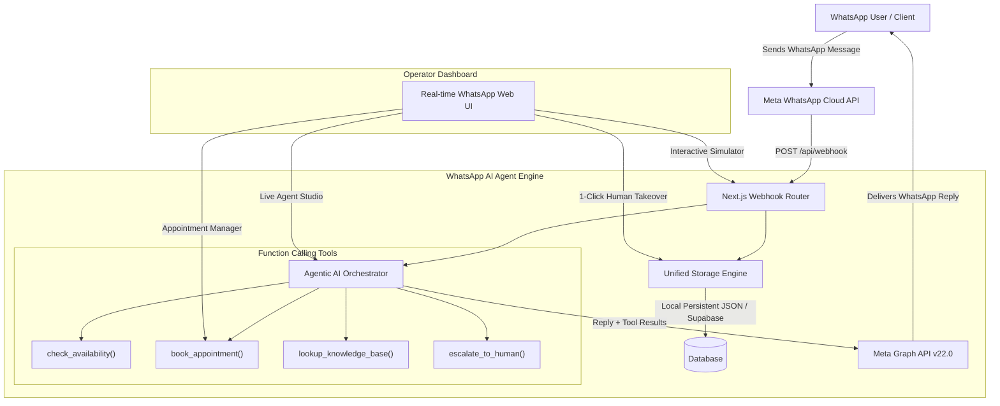

# 🚀 WhatsApp AI Agent (NextGen v2.0)

> A production-ready, full-stack **WhatsApp AI Agent** built with **Next.js 16**, **TypeScript**, **Tailwind CSS**, and **OpenAI-compatible Function Calling** (OpenRouter / Groq / OpenAI). Features a real-time WhatsApp Web-style dashboard, dual storage engine (zero-setup local store or cloud Supabase), autonomous agent tool calling (appointment scheduling, knowledge base FAQ lookup, automatic emergency/frustration escalation), and a built-in interactive webhook simulator playground.

---

## 🌟 What Makes This "Advanced & Easy"?

| Feature | Original Reference Repo | **NextGen WhatsApp Agent (This Repo)** |
|---|---|---|
| **Zero-Setup Mode** | ❌ Crashes without Supabase keys | ✅ **Runs instantly out of the box** with embedded persistent JSON engine & demo seed data |
| **Agentic Tool Calling** | ❌ None (raw text completion) | ✅ **Full Function Calling** (`check_availability`, `book_appointment`, `cancel_or_reschedule`, `lookup_knowledge_base`, `escalate_to_human`, `collect_lead`) |
| **Testing & Sandbox** | ❌ Requires Meta account & ngrok | ✅ **Built-in Interactive Simulator Playground** to test user messages & inspect tool calls in 1 click |
| **Business Personas** | ❌ Hardcoded dental prompt | ✅ **Multi-Persona Studio**: Dental/Clinic, Customer Support, E-Commerce, or Custom Prompts editable live in UI |
| **Automated Escalation** | ❌ Manual toggle only | ✅ **Sentiment & Urgency Detection**: Automatically triggers human takeover on emergencies or severe pain |
| **Multi-Provider AI** | ⚠️ Only OpenRouter | ✅ **OpenRouter, Groq (500 tok/sec), OpenAI**, plus resilient offline fallback simulator |
| **Message Formats** | ❌ Ignores non-text messages | ✅ Text, interactive button taps, voice note transcription hooks, images, and status receipts |
| **Appointment System** | ❌ Fake (doesn't save slots) | ✅ **Complete Appointment Manager** with slot validation, calendar date view, and cancellation |

---

## 🏗️ Architecture



---

## ⚡ Quickstart (Under 30 Seconds)

### 1. Clone & Install
```bash
git clone <your-repo-url>
cd wa-agent
npm install
```

### 2. Run the App
```bash
npm run dev
```

Open **[http://localhost:3000](http://localhost:3000)** in your browser!

> 💡 **Zero Setup Note**: You do NOT need any API keys or database setup to test the agent immediately. The app launches with pre-seeded test conversations, an interactive webhook simulator, and a rule-based AI engine fallback.

---

## 🎮 Built-in Interactive Webhook Simulator

Don't have a Meta Developer account or ngrok configured yet? No problem!

1. Click **"Interactive Simulator"** in the top navigation bar.
2. Choose one of the 1-click test scenarios:
   - 📅 **Book Appointment**: *"Do you have any openings for a dental cleaning this Friday morning around 10:00 AM?"*
   - 💰 **FAQ / Pricing**: *"What are your prices for routine cleaning and teeth whitening? Do you take Delta Dental?"*
   - 🚨 **Emergency Triage**: *"I am in unbearable pain after my procedure and my jaw is swelling! Can I speak to a doctor right away?"* (Triggers automated human escalation!)
   - 📍 **Location & Hours**: *"Where is your clinic located and what are your opening hours on Saturday?"*
3. Watch the agent inspect the database, execute function calling tools, update appointments, and generate the response in real time!

---

## ⚙️ Connecting Production Services

### 1. Meta WhatsApp Business Cloud API Setup

1. Go to [developers.facebook.com](https://developers.facebook.com) > **My Apps** > **Create App** (type: **Business**).
2. Under "Add products to your app", click **WhatsApp** > **Set Up**.
3. Under **WhatsApp > API Setup**:
   - Copy your **Phone Number ID** -> `WHATSAPP_PHONE_NUMBER_ID`
4. Under **Business Settings > System Users**:
   - Create a System User (Admin) and generate a permanent token with permissions:
     - `whatsapp_business_messaging`
     - `whatsapp_business_management`
   - Copy the token -> `WHATSAPP_ACCESS_TOKEN`
5. Expose your server using [ngrok](https://ngrok.com) or deploy to Vercel:
   ```bash
   ngrok http 3000
   ```
6. In Meta Dashboard > **WhatsApp > Configuration**:
   - Click **Edit** under Webhook.
   - **Callback URL**: `https://your-ngrok-url.ngrok-free.app/api/webhook`
   - **Verify Token**: `whatsapp_agent_verify_token_123` (or the value of `WHATSAPP_VERIFY_TOKEN`)
   - Click **Verify and save**.
   - Under **Webhook Fields**, subscribe to **`messages`**.

---

### 2. AI Model Providers (OpenRouter / Groq / OpenAI)

Set your key in `.env.local` or edit provider settings directly inside **Agent Studio** in the dashboard:

```env
# OpenRouter (Recommended for Claude 3.5 Sonnet / GPT-4o)
OPENROUTER_API_KEY=sk-or-v1-...
AI_MODEL=anthropic/claude-sonnet-4-20250514

# OR Groq (Ultra-fast Llama 3.3 70B ~ 500 tokens/sec)
# GROQ_API_KEY=gsk_...
# AI_MODEL=llama-3.3-70b-versatile

# OR OpenAI
# OPENAI_API_KEY=sk-...
# AI_MODEL=gpt-4o
```

---

### 3. Supabase Cloud Database (Optional)

If you wish to sync conversations to Supabase instead of the local file storage:

1. Create a project at [supabase.com](https://supabase.com).
2. Run the SQL schema from [`supabase-schema.sql`](./supabase-schema.sql) in the **Supabase SQL Editor**.
3. Fill in your credentials in `.env.local`:
   ```env
   NEXT_PUBLIC_SUPABASE_URL=https://your-project.supabase.co
   NEXT_PUBLIC_SUPABASE_ANON_KEY=eyJ...
   SUPABASE_SERVICE_ROLE_KEY=eyJ...
   ```
4. The dashboard automatically detects Supabase and switches storage mode seamlessly!

---

## 📡 API Reference

| Method | Endpoint | Description |
|---|---|---|
| `GET` | `/api/webhook` | Meta Webhook verification handshake (`hub.challenge`) |
| `POST` | `/api/webhook` | Receives incoming WhatsApp messages & delivers AI replies |
| `POST` | `/api/simulate` | Interactive Simulator endpoint for testing agent logic |
| `GET` | `/api/conversations` | Lists conversations with latest message, unread status & mode |
| `PATCH` | `/api/conversations/[id]` | Updates conversation mode (`agent` / `human`) or status |
| `GET` | `/api/conversations/[id]/messages` | Gets message history including tool execution cards |
| `POST` | `/api/conversations/[id]/send` | Sends a manual WhatsApp message from the operator |
| `GET` | `/api/appointments` | Lists appointments (supports `?phone=` filter) |
| `POST` | `/api/appointments` | Books a new appointment slot |
| `PATCH` | `/api/appointments` | Reschedules or cancels an existing appointment |
| `GET` | `/api/settings` | Gets current business persona, prompt, and model config |
| `POST` | `/api/settings` | Live updates agent instructions and active tools |
| `GET` | `/api/storage/status` | System health check (Storage engine, WhatsApp status, AI readiness) |

---

## 🛠️ Project Structure

```
wa-agent/
├── src/
│   ├── app/
│   │   ├── api/
│   │   │   ├── appointments/     # Appointment booking & rescheduling API
│   │   │   ├── conversations/    # Conversation list, mode toggle & manual send
│   │   │   ├── settings/         # Live persona & prompt configuration API
│   │   │   ├── simulate/         # Interactive WhatsApp Webhook Simulator API
│   │   │   ├── storage/status/   # System health & storage status endpoint
│   │   │   └── webhook/          # Meta WhatsApp Cloud API webhook receiver
│   │   ├── globals.css           # Tailwind CSS styles
│   │   ├── layout.tsx            # App root layout
│   │   └── page.tsx              # WhatsApp Web style Real-Time Dashboard
│   ├── components/
│   │   ├── AppointmentModal.tsx  # Appointment manager modal
│   │   ├── SettingsModal.tsx     # Agent Studio & business profile customizer
│   │   ├── SimulatorModal.tsx    # Interactive WhatsApp webhook playground
│   │   └── WebhookGuideModal.tsx # Meta webhook setup guide with live ping
│   └── lib/
│       ├── ai/
│       │   ├── engine.ts         # Multi-provider LLM caller & tool loop
│       │   ├── personas.ts       # Dental, Support, E-Commerce presets
│       │   └── tools.ts          # Function Calling tool definitions & executors
│       ├── storage/
│       │   ├── index.ts          # Unified storage abstraction
│       │   ├── local-store.ts    # Zero-config persistent local engine + seed data
│       │   └── supabase-store.ts # Supabase PostgreSQL adapter
│       ├── supabase.ts           # Supabase client wrapper
│       ├── types.ts              # Core TypeScript interfaces
│       └── whatsapp.ts           # Meta Graph API sender & simulation fallback
├── .env.example                  # Comprehensive environment template
├── .env.local                    # Local development configuration
├── package.json                  # Scripts & dependencies
├── supabase-schema.sql           # Complete Supabase PostgreSQL schema
└── tsconfig.json                 # TypeScript compiler configuration
```

---

## 🚢 Production Deployment

Deploy seamlessly to [Vercel](https://vercel.com):

```bash
vercel
```

Add your environment variables in Vercel Project Settings, then update your Meta Webhook URL to:
`https://your-app.vercel.app/api/webhook`.

---

## 📄 License
MIT License. Built for seamless developer experience and reliable WhatsApp automation.
